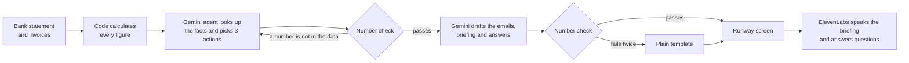

# Runway

**An AI financial assistant for small businesses. It watches the money, warns early, and does the admin to fix it.**

[](https://runwayy.streamlit.app/)


**Live demo:** [runwayy.streamlit.app](https://runwayy.streamlit.app/) · **Code:** [github.com/foysalbinislam/runway-hackathon](https://github.com/foysalbinislam/runway-hackathon)

> **Sample data only.** Bradford Auto Care, its customers and its suppliers are fictional. No bank is connected, and no email is ever sent.

## Contributors

Runway is a collaborative hackathon project, built together as a pair using AI coding assistants.

| Name   | GitHub                                                 |
| ------ | ------------------------------------------------------ |
| Foysal | [`@foysalbinislam`](https://github.com/foysalbinislam) |
| Efaz   | [`@efaz646`](https://github.com/efaz646)               |

## Contents

- [Key features](#key-features)
- [The problem](#the-problem)
- [What Runway does](#what-runway-does)
- [How it works](#how-it-works)
- [Technical highlights](#technical-highlights)
- [Built with](#built-with)
- [Run it on your computer](#run-it-on-your-computer)
- [Deploy on Streamlit Community Cloud](#deploy-on-streamlit-community-cloud)
- [Make it your own](#make-it-your-own)
- [The demo](#the-demo)
- [Sample data and known answers](#sample-data-and-known-answers)
- [Tests](#tests)
- [Troubleshooting](#troubleshooting)
- [Project structure](#project-structure)
- [Next steps](#next-steps)

## Key features

- **Early cash warning.** Forecasts cash week by week and flags the week the balance goes negative.
- **Late-payer chasing.** Finds overdue invoices and drafts a friendly or firm reminder depending on how late each one is.
- **Bill checking.** Flags unusual supplier bills and drafts a query or payment-delay email.
- **AI agent.** A Gemini agent uses function calling to look up the facts and choose the top three actions.
- **Voice.** A spoken 30-second morning briefing, plus spoken questions such as *"Who owes me money?"*, powered by ElevenLabs.
- **Numbers you can trust.** Every figure is calculated in code, and every number the AI writes is checked against the data.
- **Never breaks mid-demo.** If Gemini or ElevenLabs fails, Runway falls back to a saved analysis, a saved recording or plain text, and says so on screen.
- **Human stays in control.** Runway drafts every email but never sends anything.

## The problem

Small businesses rarely fail suddenly. They fail because money problems are spotted too late. Garage owners, shopkeepers and venue managers are busy doing the actual work, and nobody is watching the bank statement until it's too late.

## What Runway does

Meet Dave, who runs **Bradford Auto Care**, a small garage in Bradford. Runway reads his messy bank statement and invoices and:

1. **Warns him early.** It forecasts his cash week by week and finds that **cash runs short in week 5**, when VAT and his parts bill land in the same week.
2. **Chases late payers.** Three customers owe him **£5,575.50**. Runway drafts a reminder to each, friendly or firm depending on how late they are. If they pay this week, Dave never runs short.
3. **Checks his bills.** His September electricity bill was **£1,236.80**, against a usual **£391.30**. Runway flags it, suggests what to do, and drafts the query email.
4. **Talks to him.** A 30-second spoken morning briefing, and Dave can ask out loud: *"Who owes me money?"*

Dave stays in control: Runway drafts every email but **never sends anything**.

## How it works

**Code calculates. Gemini decides and writes. Code checks.**



- **Gemini is the brain.** It works as an AI agent: it calls Runway's tools (`get_cash_forecast`, `get_unpaid_invoices`, `get_supplier_bills`) to look up the facts, decides the top three actions, and writes every email, the briefing and the answers.
- **ElevenLabs is the voice.** Text-to-speech reads the briefing and answers aloud. Speech-to-text understands spoken questions.
- **The AI never makes up a number.** Every amount, date and week is calculated in code. Any number Gemini writes that isn't in the data is sent back to be fixed, and if it fails twice, a plain template is used instead.
- **The demo never breaks.** If Gemini or ElevenLabs fails, Runway shows its last verified analysis, a saved recording, or the text version, and says so on screen.

## Technical highlights

| Area                     | What it shows                                                                                                                                                                           |
| ------------------------ | --------------------------------------------------------------------------------------------------------------------------------------------------------------------------------------- |
| **AI agent design**      | Gemini function calling: the model retrieves facts through defined tools (`get_cash_forecast`, `get_unpaid_invoices`, `get_supplier_bills`) rather than guessing.                        |
| **Output validation**    | Automated number validation checks every figure in AI-written text against the calculated data, sends failures back to be fixed, then falls back to a plain template after two failures. |
| **Graceful degradation** | If Gemini or ElevenLabs fails, the app falls back to its last verified analysis, a saved recording or text, and labels the fallback on screen.                                          |
| **Data cleaning**        | Cleans a deliberately messy bank export with pandas before forecasting.                                                                                                                 |
| **Testing**              | 32 offline pytest tests using simulated Gemini and ElevenLabs clients that can be told to make mistakes, such as inventing a number, plus optional live tests.                          |
| **Known-answer data**    | Sample data is built with known answers, so every result can be checked.                                                                                                                |
| **Deployment**           | Deployed on Streamlit Community Cloud, with an optional Dockerfile for other hosts.                                                                                                     |
| **Secrets handling**     | API keys are read from `.env` or Streamlit secrets. `.env` is git-ignored and keys are never baked into the Docker image.                                                               |

## Built with

| Part            | Technology                                                                                                    |
| --------------- | ------------------------------------------------------------------------------------------------------------- |
| App and logic   | Python, Streamlit                                                                                             |
| Data and charts | pandas, Altair                                                                                                |
| AI agent        | Google Gemini (`google-genai`, function calling), `gemini-3.8-flash` with `gemini-3.5-flash-lite` as fallback |
| Voice           | ElevenLabs text-to-speech (`eleven_flash_v2_5`) and speech-to-text (`scribe_v2`)                              |
| Tests           | pytest, with simulated Gemini and ElevenLabs                                                                  |
| Hosting         | Streamlit Community Cloud (Docker optional)                                                                   |

## Run it on your computer

You need **Python 3.11 or newer** and two API keys: one from [Google AI Studio](https://aistudio.google.com) and one from [ElevenLabs](https://elevenlabs.io).

### 1. Get the code

```bash
git clone https://github.com/foysalbinislam/runway-hackathon.git
cd runway-hackathon
```

### 2. Add your keys

Create a file called `.env` in the project folder with these two lines (no quotes, no spaces):

```env
GEMINI_API_KEY=your-gemini-key
ELEVENLABS_API_KEY=your-elevenlabs-key
```

`.env` is git-ignored, so your keys are never uploaded to GitHub. Use a Gemini key that starts with **`AIza`** (see [Troubleshooting](#troubleshooting)).

### 3. Start the app

- **Windows:** double-click `run_windows.bat`. It installs everything into a `.venv` folder (first run only), checks both keys, and opens Runway in your browser.
- **Mac, Linux or Windows by hand:**

```bash
  python -m venv .venv
  source .venv/bin/activate          # Windows: .venv\Scripts\activate
  pip install -r requirements-dev.txt
  python llm.py                      # should print: PASS Gemini replied: 'OK'
  python voice.py                    # should print: PASS ElevenLabs returned ... bytes of audio
  streamlit run app.py               # then open http://localhost:8501
```

In the app, check that both keys show ✅ in the sidebar, then press **Load Dave's sample data**.

## Deploy on Streamlit Community Cloud

1. Go to [share.streamlit.io](https://share.streamlit.io), sign in with GitHub, and choose **Create app**.
2. Pick repository `foysalbinislam/runway-hackathon`, branch `main`, and main file **`app.py`**.
3. Under **Advanced settings**, choose Python 3.12 and paste this into **Secrets** (quotes are needed here):

```toml
   GEMINI_API_KEY = "your-gemini-key"
   ELEVENLABS_API_KEY = "your-elevenlabs-key"
```

4. Press **Deploy**. Then open the app once so it saves its fallback run.

To change keys later: **⋮** next to the app, then **Settings**, then **Secrets**. Every `git push` to `main` updates the live app. The microphone needs HTTPS, which Streamlit provides.

### Docker (optional, for other hosts)

Keys are passed in at run time and are never baked into the image.

```bash
docker build -t runway .
docker run -p 8501:8501 -e GEMINI_API_KEY=your-gemini-key -e ELEVENLABS_API_KEY=your-elevenlabs-key runway
```

## Make it your own

The owner, business and town are set in one place, near the top of `config.py`:

```python
BUSINESS_NAME = "Bradford Auto Care"
OWNER_NAME = "Dave"
BUSINESS_TYPE = "a small garage"
TOWN = "Bradford, Yorkshire"
```

Change them, save, and push. The new names appear everywhere: the load button, the agent, the email sign-offs and the spoken briefing. The sample customers and suppliers stay garage-themed.

## The demo

1. Open **Dave's bank export, as downloaded (messy)**.
2. Press **Load Dave's sample data**. Runway's agent works live and warns: *cash runs short in week 5*.
3. Read out the three actions under **What Runway recommends**.
4. Press **Open 3 draft reminders**. Nothing is sent.
5. Press **Play the 30-second briefing**, then ask *"Who owes me money?"* under **Ask Runway**.
6. Open **What Runway's agent did** to show the agent's steps.

### Before presenting

Open the app 10 minutes early (free Streamlit apps sleep), load the data once so the fallback is saved, turn the sound up, and allow the microphone.

Use the sidebar switches **Pretend Gemini is down** and **Pretend ElevenLabs is down** to rehearse the fallbacks.

## Sample data and known answers

The sample data is built with known answers, so every result can be checked. "Today" in the data is Monday 5 October 2026. Run `python make_sample_data.py` to rebuild it.

| Check            | Known answer                                                                                                                            |
| ---------------- | --------------------------------------------------------------------------------------------------------------------------------------- |
| Cash today       | £3,600.00                                                                                                                               |
| Cash runs short  | Week 5 (week of 2 Nov), balance -£1,952.24                                                                                              |
| Why week 5       | VAT (£4,600.00) and the parts account (£2,450.35) both fall due                                                                         |
| Overdue invoices | Exactly 3: Shipley Van Hire £2,475.00 (49 days), Calder Plumbing & Heating £1,240.50 (31 days), Wharfe Valley Taxis £1,860.00 (12 days) |
| Not yet due      | Bingley Florists £385.00, Airedale Couriers £1,120.00                                                                                   |
| Bill spikes      | Exactly 1: September electricity, £1,236.80 against a usual £391.30                                                                     |

## Tests

```bash
pytest -q                          # 32 offline tests, no keys needed
pytest -q tests/test_live.py -s    # live tests against the real Gemini and ElevenLabs (needs keys)
```

After using `run_windows.bat`, install pytest first: `.venv\Scripts\python -m pip install pytest`, then run `.venv\Scripts\python -m pytest -q`.

| Test case               | What is checked automatically                                                                                                       | Check by hand                                                     |
| ----------------------- | ----------------------------------------------------------------------------------------------------------------------------------- | ----------------------------------------------------------------- |
| TC1 Forecast            | Cash runs short in week 5, the chart dips below zero in week 5, exactly 3 actions, invented numbers are sent back                   | The three actions make sense                                      |
| TC2 Late payment chaser | Exactly 3 overdue invoices; each draft names the right customer, amount and days overdue; nothing can be sent                       | The tone reads right: friendly, firm, final                       |
| TC3 Bill checker        | Exactly 1 spike (September electricity); the query email quotes the real amounts                                                    | Only September is highlighted; Gemini's suggestions fit           |
| TC4 Voice               | The briefing matches the figures; "who owes me money?" names all 5 customers and amounts; without a key, the text briefing is shown | It plays on the demo speakers and hears your question in the room |

The offline tests use simulated versions of Gemini and ElevenLabs that can be told to make mistakes, such as inventing a number, to prove Runway catches them.

## Troubleshooting

| Problem                                          | Fix                                                                                                                                                                                                  |
| ------------------------------------------------ | ---------------------------------------------------------------------------------------------------------------------------------------------------------------------------------------------------- |
| `No module named 'google'`                       | The packages aren't installed for the Python you used. Use `run_windows.bat`, or run `.venv\Scripts\python -m streamlit run app.py`. Don't use VS Code's ▶ Run button.                                |
| Keys show ❌ missing                              | Check the file is named exactly `.env`, not `.env.txt`, and is in the same folder as `app.py`. Save it, then refresh the page.                                                                       |
| Gemini error `401 ACCESS_TOKEN_TYPE_UNSUPPORTED` | Your Gemini key starts with `AQ.`. These new-style keys are currently rejected by the Gemini API. Create a key that starts with `AIza` in Google AI Studio, ideally in an older Google Cloud project. |
| Keys show ❌ on Streamlit Cloud                   | Check the Secrets use quotes, then choose **⋮** and **Reboot app**.                                                                                                                                  |
| Gemini or ElevenLabs is down                     | The app keeps working with its saved run or text fallbacks, and labels them on screen.                                                                                                               |

## Project structure

```text
├── app.py                 # the one-screen Streamlit app
├── forecast.py            # cleans the bank data; weeks of cash left and the shortfall week
├── chaser.py              # finds overdue invoices; reminder drafts
├── bills.py               # finds bill spikes; query and payment-delay emails
├── llm.py                 # Gemini agent, number check, fallbacks
├── voice.py               # ElevenLabs briefing and spoken questions
├── config.py              # names, thresholds, models; reads the API keys
├── make_sample_data.py    # builds Dave's sample data
├── bank_statement.csv     # sample data (messy on purpose)
├── invoices.csv           # sample data
├── run_windows.bat        # one-click start on Windows
├── requirements.txt       # app packages
├── requirements-dev.txt   # plus pytest
├── Dockerfile             # optional container
├── .streamlit/            # theme and an example secrets file
└── tests/                 # offline tests, live tests, simulated APIs
```

## Next steps

- Pilot Runway with local Yorkshire businesses.
- Connect to the accounting software they already use, through read-only links.
